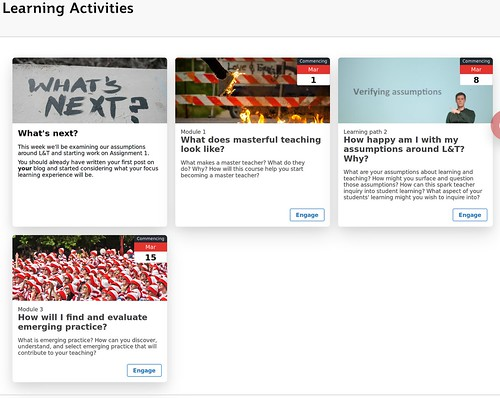

# Card Interface Tweak

Insert a bit of HTML/CSS/Javascript into a [Blackboard Learn](https://en.wikipedia.org/wiki/Blackboard_Learn) content area and transform it into a responsive, image rich [card interface](https://www.smashingmagazine.com/2016/10/designing-card-based-user-interfaces/). 

| **Before** | **After**| 
| --- | ---- |
|  |  |

## Documentation

See [the Card Interface documentation site] for more detail on what this is, why you'd want to use it, and how.
