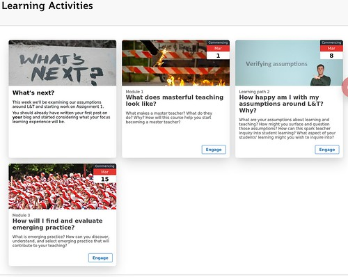

# Card Interface Tweak documentation

The Card Interface Tweak is a bit of Javascript/CSS that will transform a standard [Blackboard Learn](https://en.wikipedia.org/wiki/Blackboard_Learn) content area into a responsive, image rich [card interface](https://www.smashingmagazine.com/2016/10/designing-card-based-user-interfaces/).

| **Before** | **After**| 
| --- | ---- |
|  |  |

<link rel="stylesheet" href="https://s3.amazonaws.com/filebucketdave/banner.js/cards.css">

 
  

    <!--
 Relative could go -->
    
 <!-- Relative could go -->
      <a href="whatWhy/">
      

      

      </a>
      

        <h3 class="mb-1 text-2xl"><a href="whatWhy/" class="text-black no-underline hover:underline">What and why?</a></h3>
        

           
What does it do? Why is this an educationally good idea?
 
        

        
&nbsp;  

        

           <a href="whatWhy/" class="gu-engage">

            Engage
        

        

      

    

  

  

    <!--
 Relative could go -->
    
 <!-- Relative could go -->
      <a href="createCards/">
      

      

      </a>
      

        <h3 class="mb-1 text-2xl"><a href="createCards/" class="text-black no-underline hover:underline">Create Cards</a></h3>
        

           
How do you add cards to your Blackboard Learn content area?
 
        

        
&nbsp;  

        

           <a href="createCards/" class="gu-engage">

            Engage
        

        

      

    

  

  

    <!--
 Relative could go -->
    
 <!-- Relative could go -->
      <a href="customiseACard/">
      

      

      </a>
      

        <h3 class="mb-1 text-2xl"><a href="customiseACard/" class="text-black no-underline hover:underline">Customise a Card</a></h3>
        

           
How do you:

           <ul>
             <li> Add an image? </li>
             <li> Use a background colour?</li>
             <li> Add a date or date range?</li>
             <li> Change/remove the label? </li>
           </ul>
        

        
&nbsp;  

        

           <a href="customiseACard/" class="gu-engage">

            Engage
        

        

      

    

  

  

    <!--
 Relative could go -->
    
 <!-- Relative could go -->
      <a href="customiseAllCards/">
      

      

      </a>
      

        <h3 class="mb-1 text-2xl"><a href="customiseAllCards/" class="text-black no-underline hover:underline">Customise all cards</a></h3>
        

           
How do you:

           <ul>
             <li> Select a different card template? </li>
             <li> Change the number of cards per row?</li>
             <li> Change/remove "Engage"? </li>
             <li> Change the order of cards?</li>
           </ul>
        

        
&nbsp;  

        

           <a href="customiseAllCards/" class="gu-engage">

               Engage
        
</a>
        

      

    

  

### Image Attribution

["Question mark, Ipswich, 21 January 2010"](https://www.flickr.com/photos/omcoc/6751047205) by [ed_needs_a_bicycle](https://www.flickr.com/photos/omcoc/6751047205) is licensed under [CC BY-NC-SA 2.0](http://creativecommons.org/licenses/by-nc-sa/2.

["Creation"](https://www.flickr.com/photos/92559558@N04/15323880649/) by [Ha Jeong Jeong](https://www.flickr.com/photos/92559558@N04/) is licensed under [CC BY-SA 2.0](http://creativecommons.org/licenses/by-sa/2.

["Custom"](https://www.flickr.com/photos/86755183@N04/9720306280/) by [Fred More](https://www.flickr.com/photos/86755183@N04/) is licensed under [CC BY-NC 2.0](http://creativecommons.org/licenses/by-nc/2.

["Nakuru, The Lake of 1,000,000 Flamingos"](https://www.flickr.com/photos/rayinmanila/49629884077/) by [Ray in Manilla](ihttps://www.flickr.com/photos/rayinmanila/) is licensed under [CC BY 2.0](http://creativecommons.org/licenses/by/2.